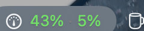

# AI Usage Monitor 📊

[](https://www.apple.com/macos/)
[](https://swift.org)
[](LICENSE)
[](Sources/main.swift)

A tiny macOS menu bar app that keeps your Claude Code and Codex limits in sight. It runs
`claude -p /usage` and reads Codex's authenticated local app-server usage snapshot for you.

<p align="center">
  
</p>

The number sits in the system's own label colour, so it reads like every other menu bar
item in both light and dark mode. It turns red only past 85% — the one moment the number
is actually news.

## Why

`/usage` already tells you everything, but only from inside a session, and only if you stop
what you are doing to ask. This is that same report on a permanent shelf: the number lives
in the menu bar and the full breakdown is one click away.

It is the macOS counterpart of the Claude usage module in Omarchy's waybar.

## Usage

**Click** the gauge and switch between the **Claude** and **Codex** tabs for either report:

```
Claude Code · subscription
──────────────────────────────────────
Session             ████░░░░░░   43%
      resets Aug 28 at 8:59pm
Week (all models)   █░░░░░░░░░    5%
      resets Sep 4 at 3:59pm
──────────────────────────────────────
Last 7d · 2829 requests · 21 sessions
  80% of your usage was at >150k context
  49% of your usage came from sessions active for 8+ hours
  14% of your usage came from subagent-heavy sessions
──────────────────────────────────────
Refresh Now (updated 17:15)          ⌘R
Menu Bar Shows                        ▸
Refresh Every                         ▸
Settings…                            ⌘,
Copy Report                          ⌘C
Launch at Login
──────────────────────────────────────
Quit AI Usage Monitor                ⌘Q
```

- **Settings…** — enable or disable monitoring per provider (Claude Code and Codex). A
  disabled provider stops being polled and disappears from the menu bar, tab and report.
- **Menu Bar Shows** — session percentage (default), week, both, or icon only.
- **Refresh Every** — 1, 5 (default), 15, 30 or 60 minutes. It also refreshes whenever you
  open the menu and whenever the Mac wakes from sleep.
- **Copy Report** — the raw `/usage` text on the clipboard.

Every limit row the CLI reports is rendered, so a plan that reports a separate Opus weekly
cap gets its own gauge without any change here.

Two headless entry points, for scripts:

```sh
/Applications/AIUsageMonitor.app/Contents/MacOS/AIUsageMonitor --print            # limits to stdout
/Applications/AIUsageMonitor.app/Contents/MacOS/AIUsageMonitor --print-codex      # Codex limits
/Applications/AIUsageMonitor.app/Contents/MacOS/AIUsageMonitor --login-item on    # or off / status
```

If macOS reports `requires approval`, enable it under
**System Settings → General → Login Items**.

## Install

```sh
git clone https://github.com/marionuevo/ClaudeUsage.git
cd ClaudeUsage
./build.sh
cp -R build/AIUsageMonitor.app /Applications/
codesign --force --sign - /Applications/AIUsageMonitor.app
open /Applications/AIUsageMonitor.app
```

Re-signing after the copy matters — a moved bundle's ad-hoc signature can otherwise go
stale and macOS will refuse to launch it.

Requires the Claude Code and/or Codex CLI on the machine, signed in. If one is unavailable,
its tab shows the error while the other continues to work normally.

## Build

```sh
./build.sh          # produces build/AIUsageMonitor.app (universal arm64 + x86_64, ad-hoc signed)
```

Requires only the Xcode Command Line Tools (`xcode-select --install`) — there is no Xcode
project and no package manager. The entire app is one Swift file, `Sources/main.swift`,
compiled straight into a hand-assembled `.app` bundle by `build.sh`.

Minimum macOS is 13. The gauge glyph is a macOS 14 SF Symbol, so on 13 the icon falls back
to the plain `gauge`.

## How it works

`/usage` is a *local* slash command: `claude -p "/usage"` answers in about a second, reads
your subscription limits over the same authenticated connection the CLI already uses, and
spends no tokens — the poll does not show up in the numbers it is reporting. The app runs
that command, parses the `Current …: N% used · resets …` lines with one regular expression,
and draws them.

Nothing else happens in the background: between refreshes the app is an idle timer and a
status item. It never reads your credentials — each CLI holds those — and it talks to no
network service of its own. Codex usage comes from `account/rateLimits/read` on a short-lived
local `codex app-server` process, including its rolling and weekly windows and reset times.

The `claude` binary is found at `~/.local/bin`, `~/.claude/local`, Homebrew or `/usr/local`,
falling back to asking a login shell. A refresh that hangs is killed after 45 seconds, and
any failure — CLI missing, signed out, timed out — shows as `!` in the menu bar with the
reason in the menu.

## License

[MIT](LICENSE) © 2026 Mario Nuevo
